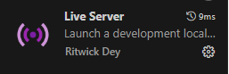

# My_Battleship

This project is a student project, released by Vincent Naulleau and Guillaume Reboullet for our first year at school. It aims to reproduce the famous 'Battleship' game locally between one user and the computer.

## Implemented functions:

- Place and replace your ships on the big map.
- Position your ships horizontally and vertically.
- Choose who begins the game.
- Make random shots.
- Implement victory conditions.

## Project Setup

This project was bootstrapped with:
- HTML
- CSS
- JavaScript

### !! Sound on, but be careful with the volume !!

### Available Scripts

1. Navigate to the project repository:
   ```bash
   cd W-JSC-501-PAR-1-1-battleship-vincent.naulleau
2. Start the local server with http-server:
       ```bash
    npx http-server
3. Access the project at:
   http://127.0.0.1:8080/
   
4. To stop the server, use ctrl+c.

Alternatively, you can start your local server directly from your code editor using extensions like:
### 
